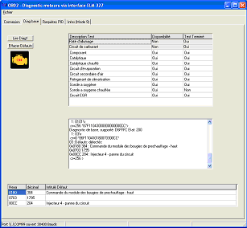
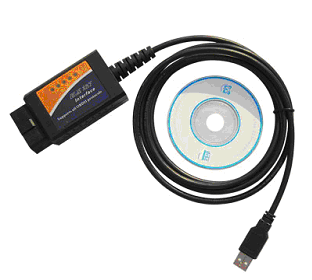
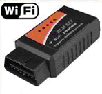
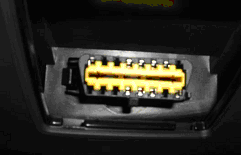
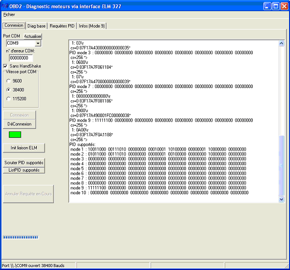
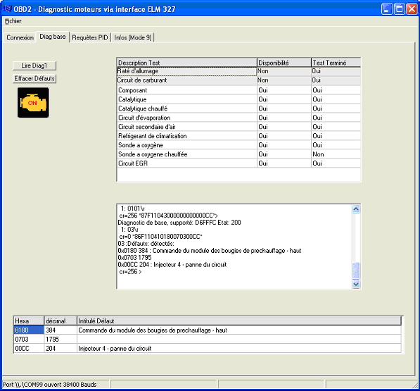
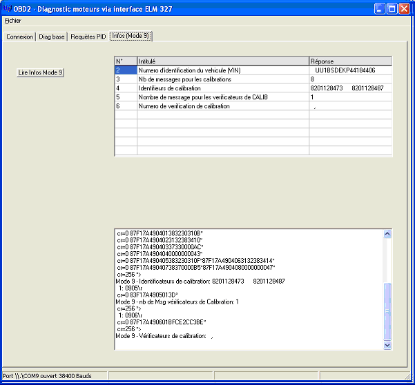
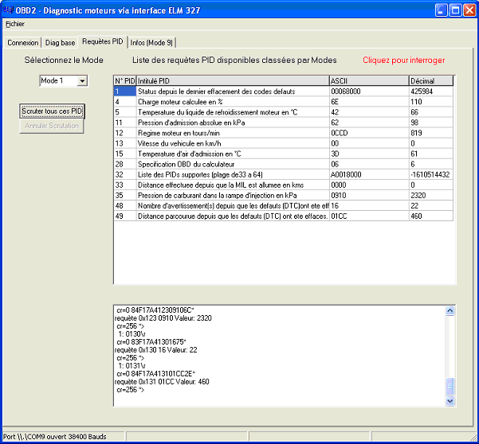

# Obd2BV

Windows app to List and Reset your car defaults with an OBD2 interface 

This sotfware has been develloped under C++ Builder 6

It can connect to the engine CPU with an ELM327 interface via Serial link or Bluetooth or wiFi  

You can show the car's defaults and reset them
Connection :  

Diagnostic :

Informations :

PID : 

